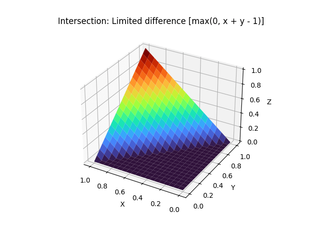
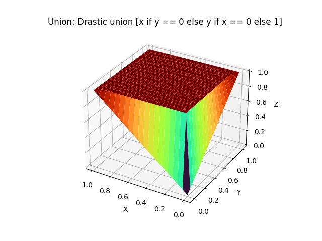
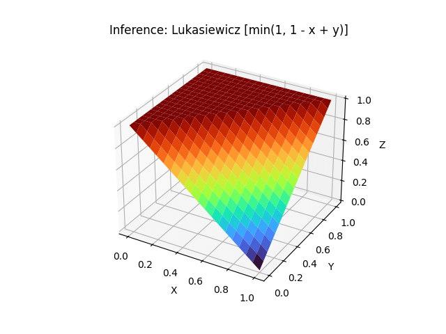

# Visual representation of some operators of fuzzy logic

To run it you'll need matplotlib.
You can setup a virtual environment inside the project folder with

    virtualenv -p python3 venv
    source venv/bin/activate
    pip install -r requirements.txt

The two values that can be easily adjusted in the code are `TILES` and `COLOR_MAP`.
- Increasing or decreasing the value of `TILES` makes the figure more or less fine-grained.
- Possible values to assign to `COLOR_MAP` can be found in this 
[colormap reference](https://matplotlib.org/users/colormaps.html#grayscale-conversion).

#### Truth table

x | y | x AND y | x OR y | IF x THEN y
:---: | :---: | :---: | :---: | :---:
0 | 0 | 0 | 0 | 1
0 | 1 | 0 | 1 | 1
1 | 0 | 0 | 1 | 0 
1 | 1 | 1 | 1 | 1

## Intersection (x AND y)

## Union (x OR y)

## Inference (IF x THEN y)
Note that the range values for `x` are inverted compared to Intersection and Union 
to make it easier to see the surface.

