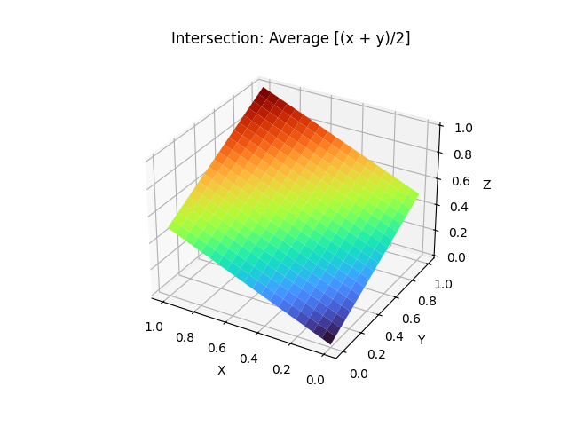
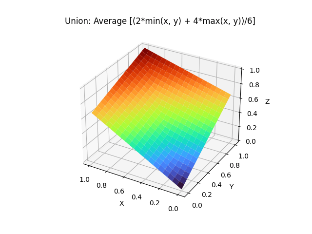
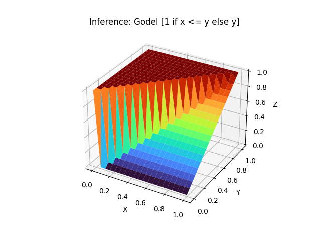

# Visual Representation of Some Fuzzy Logic Operators

When working with boolean algebra, the values of the variables can only be `true` or `false` (`1` or `0` when represented as numbers). Fuzzy logic is the term used when the values can be any real number between `0` and `1`.

The following section shows the boolean algebra truth table.

The section after it shows the result of applying the fuzzy logic operators to the continuous `x` and `y` values and plotting the result on the `z` axis.

## Boolean Algebra

`x` | `y` | `x AND y` | `x OR y` | `IF x THEN y` (`NOT x OR y`)
:---: | :---: | :---: | :---: | :---:
0 | 0 | 0 | 0 | 1
0 | 1 | 0 | 1 | 1
1 | 0 | 0 | 1 | 0 
1 | 1 | 1 | 1 | 1

## Fuzzy Logic Operators

### Intersection (`x AND y`)





### Union (`x OR y`)





### Inference (`IF x THEN y`)

Note that the range values for `x` are inverted compared to Intersection and Union 
to make it easier to see the surface.





## How to run the code

To run the code in `fuzzy-operators-visualization.py` you'll need `Python 3` and the `matplotlib` library.
You can set up a virtual environment inside the project folder and install `matplotlib` with the following commands.

```bash
python3 -m venv venv
source venv/bin/activate
pip install -r requirements.txt
```

There are several variables at the beginning of `fuzzy-operators-visualization.py` that can be changed to generate different results:
- `TILES`: Controls how fine-grained the surface will be. A higher number results in a smoother/less blocky surface. The default is `20`.
- `COLOR_MAP`: Defines the color palette to be used. Possible values to use to can be found in this 
[colormap reference](https://matplotlib.org/stable/users/explain/colors/colormaps.html). The default is `turbo`.
- `SAVE_IMAGES`: If set to `True`, generates png files for each representation and stores it in the `images` folder. The default is `False`.
- `SHOW_IMAGES`: If set to `True`, show each representation in a window. The default is `True`.

To see all available color maps, run the following code in a Python session.

```python
from matplotlib import colormaps
print(colormaps)
```

Once everything is set up, run the script with the following command.

```bash
python3 fuzzy-operators-visualization.py
```
